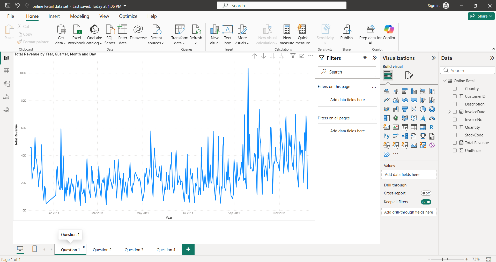

📊 Retail Sales Analysis using Power BI
📌 Project Overview

This project was completed as part of the Tata Data Visualisation: Empowering Business with Effective Insights Virtual Experience Program on Forage.

The objective was to analyze an online retail dataset and create Power BI visualizations that answer business questions from the CEO and CMO. The project demonstrates the complete workflow from data cleaning to business insight generation.

🎯 Business Objectives

The following analyses were completed:

📈 Monthly Revenue Trend for 2011
🌍 Top 10 Countries by Revenue (excluding the United Kingdom)
👥 Top 10 Customers by Revenue
📦 Product Demand by Country (excluding the United Kingdom)
🧹 Data Cleaning

Before building the visualizations, the dataset was cleaned by:

Removing records where Quantity < 1
Removing records where Unit Price ≤ 0
Creating a new Revenue column using:
Revenue = Quantity × Unit Price
📊 Visualizations
1. Monthly Revenue Trend (2011)

A line chart showing monthly revenue throughout 2011 to identify seasonal sales trends.

2. Top 10 Countries by Revenue

A clustered bar chart comparing revenue and quantity sold for the top-performing countries (excluding the United Kingdom).

3. Top 10 Customers by Revenue

A column chart highlighting the highest revenue-generating customers.

4. Product Demand by Country

A map visualization displaying product demand across different countries to identify potential expansion opportunities.

🛠️ Tools & Technologies
Power BI
Power Query
DAX
Microsoft Excel
Data Visualization
📈 Key Insights
Monthly revenue trends reveal seasonal fluctuations in customer purchases.
A small number of customers contribute a significant share of total revenue.
Several international markets show strong sales performance outside the United Kingdom.
Country-wise demand analysis can support future business expansion decisions.
💡 Skills Demonstrated
Data Cleaning
Data Transformation
Power Query
DAX Calculations
Business Intelligence
Data Visualization
Dashboard Development
Business Insight Generation
Storytelling with Data
📷 Project Preview

📚 Dataset

Online Retail Dataset provided as part of the Tata Forage Virtual Experience Program for educational purposes.